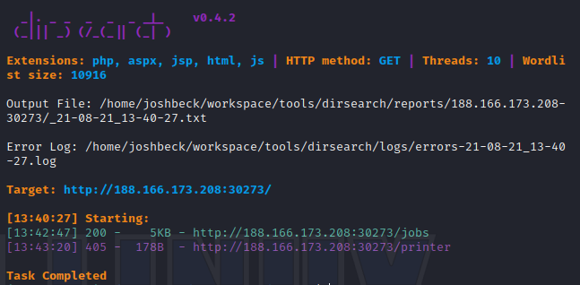

# Wander

### Scenario and enum
<p>
  We start with loading up the http landing page, then running dirsearch. We find that the site has 2 pages, a /jobs and a /printer page.
</p>



<p>
  looking closer at the job controls input box, it gives a sample @PJL command. This results in a basic info text return. I google to find similar commands, and discover this is something called Printer Job Language.
</p>


### Troubleshooting and solving
<p>
  After some googling, I discover an article that shows exploitation though access to file system. I then use this to find the path to the etc/passwd file. After this, I use a second site which prints out the information in a given file on the system. Realizing that etc/passwd is not the correct target for this challenge, I then switch gears, using the same file system commands to get to the flag file, which I open using commands frome the second site below.
</p>

###### Similar to the 'ls' or 'dir' command
```
@PJL	FSDIRLIST	NAME="0:/../../etc"
```


###### Similar to the 'cat' command
```
> @PJL FSQUERY NAME="0:\..\..\etc\passwd"                      (read from file)
< @PJL FSQUERY NAME="0:\..\..\etc\passwd" TYPE=FILE SIZE=23    (some process for file)
> @PJL FSUPLOAD NAME="0:\..\..\etc\passwd" OFFSET=0 SIZE=23    (print file)
```


[Site](https://www.tenable.com/blog/rooting-a-printer-from-security-bulletin-to-remote-code-execution) for digging through file system.

[Site](http://hacking-printers.net/wiki/index.php/File_system_access) for printing out text from file system, using PJL commands.


